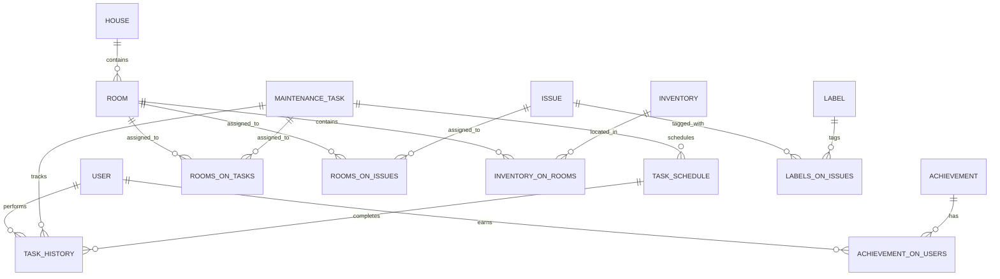

# Home Sweet Home - Database Schema

**Last Updated**: May 8, 2026  
**Database**: PostgreSQL  
**ORM**: Prisma 5.22.0

---

## Table of Contents
1. [Entity-Relationship Diagram](#entity-relationship-diagram)
2. [Data Models](#data-models)
3. [Enums](#enums)
4. [Relationships](#relationships)
5. [Constraints & Validations](#constraints--validations)
6. [Common Queries](#common-queries)
7. [Migration Strategy](#migration-strategy)

---

## Entity-Relationship Diagram



---

## Data Models

### Core Entities

#### **User**
Represents application users with authentication and role information.

| Field | Type | Constraints | Notes |
|-------|------|-------------|-------|
| `id` | `Int` | `@id @autoincrement` | Primary key |
| `email` | `String` | `@unique` | Login identifier |
| `firstName` | `String?` | Nullable | Optional first name |
| `lastName` | `String` | Required | Last name |
| `followers` | `Int` | Default: 0 | Gamification metric |
| `isActive` | `Boolean` | Default: true | Account status |
| `password` | `String` | Default: "password" | Currently unused |
| `registeredAt` | `DateTime` | Default: now() | Account creation date |
| `role` | `Role` | Default: VIEWER | ADMIN, EDIT, or VIEWER |
| `TaskHistory` | Relation | 1:M | Tasks performed by user |
| `achievements` | Relation | M:M | User's unlocked achievements |

**Primary Key**: `id`  
**Unique Constraints**: `email`

---

#### **House**
Represents a single house being managed.

| Field | Type | Constraints | Notes |
|-------|------|-------------|-------|
| `houseId` | `Int` | `@id` | Primary key (not auto) |
| `street` | `String` | Required | Street address |
| `city` | `String` | Required | City name |
| `squarefootage` | `Int?` | Nullable | Property size |
| `Rooms` | Relation | 1:M | Rooms in house |

**Primary Key**: `houseId`  
**Note**: Currently assumes single house per application instance.

---

#### **Room**
Represents a room/area within the house.

| Field | Type | Constraints | Notes |
|-------|------|-------------|-------|
| `roomId` | `Int` | `@id @autoincrement` | Primary key |
| `name` | `String` | Required | Full room name (e.g., "Master Bedroom") |
| `shortName` | `String` | Default: "Short" | Abbreviated name for UI |
| `notes` | `String?` | Nullable | Room-specific notes |
| `houseId` | `Int` | `@fk` | Foreign key to House |
| `House` | Relation | N:1 | Parent house |
| `tasks` | Relation | M:M | Tasks assigned to room |
| `issues` | Relation | M:M | Issues assigned to room |
| `inventory` | Relation | M:M | Inventory in room |

**Primary Key**: `roomId`  
**Foreign Keys**: `houseId` → `House.houseId`

---

#### **MaintenanceTask**
Represents a periodic maintenance task (e.g., "Clean gutters").

| Field | Type | Constraints | Notes |
|-------|------|-------------|-------|
| `taskId` | `Int` | `@id @autoincrement` | Primary key |
| `taskName` | `String` | Required | Task name/title |
| `description` | `String?` | `@db.Text` Nullable | Detailed description |
| `timeEstimate` | `Int?` | Nullable | Estimated minutes to complete |
| `frequency` | `Frequency` | Default: YEARLY | How often to repeat (see Enums) |
| `importance` | `Importance` | Default: MEDIUM | Priority level |
| `season` | `Season?` | Nullable | Seasonal indicator (WINTER, SPRING, etc.) |
| `taskSchedule` | Relation | 1:M | Schedule instances |
| `taskHistory` | Relation | 1:M | Completion history |
| `rooms` | Relation | M:M | Rooms task applies to |

**Primary Key**: `taskId`

---

#### **taskSchedule**
Represents a scheduled instance of a maintenance task.

| Field | Type | Constraints | Notes |
|-------|------|-------------|-------|
| `scheduleId` | `Int` | `@id @autoincrement` | Primary key |
| `taskId` | `Int` | `@fk` | Foreign key to MaintenanceTask |
| `task` | Relation | N:1 | Parent task |
| `nextDueDate` | `DateTime` | Required | When task is due |
| `lastCompletedDate` | `DateTime?` | Nullable | When last completed |
| `status` | `Status` | Default: PENDING | Current status |
| `notes` | `String?` | `@db.Text` Nullable | Task-specific notes |

**Primary Key**: `scheduleId`  
**Foreign Keys**: `taskId` → `MaintenanceTask.taskId`  
**Indexes**: Should index on `nextDueDate` for calendar queries

---

#### **taskHistory**
Records completed/skipped tasks for audit trail.

| Field | Type | Constraints | Notes |
|-------|------|-------------|-------|
| `historyId` | `Int` | `@id @autoincrement` | Primary key |
| `taskId` | `Int` | `@fk` | Foreign key to MaintenanceTask |
| `task` | Relation | N:1 | Task that was performed |
| `userPerformedId` | `Int` | `@fk` | Foreign key to User |
| `User` | Relation | N:1 | User who performed task |
| `datePerformed` | `DateTime` | Default: now() | When action occurred |
| `monthPerformed` | `Int` | Default: 8 | Month of performance |
| `yearPerformed` | `Int` | Default: 2024 | Year of performance |
| `status` | `Status` | Default: COMPLETED | COMPLETED, SKIPPED, CANCELLED |
| `notes` | `String?` | `@db.Text` Nullable | Completion notes |

**Primary Key**: `historyId`  
**Foreign Keys**: `taskId` → `MaintenanceTask.taskId`, `userPerformedId` → `User.id`

---

#### **Issue**
Represents a home issue/problem to be resolved.

| Field | Type | Constraints | Notes |
|-------|------|-------------|-------|
| `issueId` | `Int` | `@id @autoincrement` | Primary key |
| `title` | `String` | Required | Issue summary |
| `description` | `String?` | Nullable | Detailed description |
| `createdAt` | `DateTime` | Default: now() | Creation date |
| `updatedAt` | `DateTime` | Default: now() | Last update date |
| `completedAt` | `DateTime?` | Nullable | Resolution date |
| `createdBy` | `Int?` | Nullable | User ID who created issue |
| `completedBy` | `Int?` | Nullable | User ID who resolved issue |
| `notes` | `String?` | Nullable | Resolution notes |
| `status` | `Status` | Required | PENDING, COMPLETED, SKIPPED, CANCELLED |
| `priority` | `Importance` | Required | HIGH, MEDIUM, LOW |
| `labels` | Relation | M:M | Labels/tags |
| `rooms` | Relation | M:M | Rooms affected |

**Primary Key**: `issueId`

---

#### **Inventory**
Represents household items/equipment to track.

| Field | Type | Constraints | Notes |
|-------|------|-------------|-------|
| `invId` | `Int` | `@id @autoincrement` | Primary key |
| `name` | `String` | Required | Item name |
| `type` | `String` | Required | Item category/type |
| `content` | `String` | Required | Detailed description |
| `rooms` | Relation | M:M | Rooms containing item |

**Primary Key**: `invId`

---

#### **Label**
Represents tags/labels for issues.

| Field | Type | Constraints | Notes |
|-------|------|-------------|-------|
| `labelId` | `Int` | `@id @autoincrement` | Primary key |
| `name` | `String` | Required | Label text |
| `labels` | Relation | M:M | Issues with this label |

**Primary Key**: `labelId`

---

#### **Achievement**
Represents a gamification achievement users can unlock.

| Field | Type | Constraints | Notes |
|-------|------|-------------|-------|
| `achievementId` | `Int` | `@id @autoincrement` | Primary key |
| `category` | `AchievementCategory` | Required | STREAK or ISSUES |
| `name` | `String` | Required | Achievement name |
| `description` | `String?` | Nullable | Achievement description |
| `target` | `Int` | Default: 0 | Target count to unlock |
| `pointsValue` | `Int?` | Nullable | Points awarded |
| `users` | Relation | M:M | Users with achievement |

**Primary Key**: `achievementId`

---

### Junction Tables (Many-to-Many)

#### **RoomsOnTasks**
Associates tasks with rooms and tracks audit metadata.

| Field | Type | Constraints | Notes |
|-------|------|-------------|-------|
| `taskId` | `Int` | `@fk` | Foreign key to MaintenanceTask |
| `roomId` | `Int` | `@fk` | Foreign key to Room |
| `task` | Relation | N:1 | MaintenanceTask |
| `room` | Relation | N:1 | Room |
| `assignedAt` | `DateTime` | Default: now() | Assignment date |
| `assignedBy` | `String` | Required | Who made assignment |

**Composite Primary Key**: `[taskId, roomId]`  
**Foreign Keys**: `taskId` → `MaintenanceTask.taskId`, `roomId` → `Room.roomId`

---

#### **RoomsOnIssues**
Associates issues with rooms.

| Field | Type | Constraints | Notes |
|-------|------|-------------|-------|
| `issueId` | `Int` | `@fk` | Foreign key to Issue |
| `roomId` | `Int` | `@fk` | Foreign key to Room |
| `issue` | Relation | N:1 | Issue |
| `room` | Relation | N:1 | Room |
| `assignedAt` | `DateTime` | Default: now() | Assignment date |
| `assignedBy` | `String` | Required | Who made assignment |

**Composite Primary Key**: `[issueId, roomId]`

---

#### **InventoryOnRooms**
Associates inventory items with rooms.

| Field | Type | Constraints | Notes |
|-------|------|-------------|-------|
| `roomId` | `Int` | `@fk` | Foreign key to Room |
| `invId` | `Int` | `@fk` | Foreign key to Inventory |
| `room` | Relation | N:1 | Room |
| `inventory` | Relation | N:1 | Inventory item |
| `assignedAt` | `DateTime` | Default: now() | Assignment date |
| `assignedBy` | `String` | Required | Who made assignment |

**Composite Primary Key**: `[roomId, invId]`

---

#### **LabelsonIssues**
Associates labels with issues.

| Field | Type | Constraints | Notes |
|-------|------|-------------|-------|
| `issueId` | `Int` | `@fk` | Foreign key to Issue |
| `labelId` | `Int` | `@fk` | Foreign key to Label |
| `issue` | Relation | N:1 | Issue |
| `label` | Relation | N:1 | Label |
| `assignedAt` | `DateTime` | Default: now() | Assignment date |
| `assignedBy` | `String` | Required | Who made assignment |

**Composite Primary Key**: `[issueId, labelId]`

---

#### **AchievementOnUsers**
Tracks unlocked achievements per user.

| Field | Type | Constraints | Notes |
|-------|------|-------------|-------|
| `achievementId` | `Int` | `@fk` | Foreign key to Achievement |
| `userId` | `Int` | `@fk` | Foreign key to User |
| `achievement` | Relation | N:1 | Achievement |
| `user` | Relation | N:1 | User |
| `unlockedAt` | `DateTime` | Required | When achievement unlocked |

**Composite Primary Key**: `[achievementId, userId]`

---

## Enums

### **Status**
Represents the state of tasks and issues.

```
PENDING    - Not yet completed or resolved
COMPLETED  - Successfully completed/resolved
SKIPPED    - Deferred or intentionally skipped
CANCELLED  - Cancelled and will not be completed
```

**Used In**:
- `taskSchedule.status` (next due task)
- `taskHistory.status` (completed task record)
- `Issue.status` (current issue state)

---

### **Frequency**
Determines how often a maintenance task repeats.

```
WEEKLY     - Every week
MONTHLY    - Every month
QUARTERLY  - Every 3 months
YEARLY     - Every year
ADHOC      - One-time task (no auto-repeat)
```

**Used In**: `MaintenanceTask.frequency`

---

### **Importance**
Priority/urgency level.

```
HIGH    - Urgent, address immediately
MEDIUM  - Normal priority
LOW     - Can be deferred
```

**Used In**:
- `MaintenanceTask.importance` (task priority)
- `Issue.priority` (issue urgency)

---

### **Season**
Seasonal categorization for tasks.

```
NONE   - Year-round
WINTER - Winter months
SPRING - Spring months
SUMMER - Summer months
FALL   - Fall/autumn months
```

**Used In**: `MaintenanceTask.season`

---

### **Role**
User permission levels.

```
ADMIN  - Full system access (user management, admin panel)
EDIT   - Create, read, update records (but no admin functions)
VIEWER - Read-only access (view dashboards, lists, details)
```

**Used In**: `User.role`

---

### **AchievementCategory**
Types of achievements.

```
STREAK - Consecutive task completions
ISSUES - Number of issues resolved
```

**Used In**: `Achievement.category`

---

## Relationships

### One-to-Many (1:M)

| Parent | Child | Relationship | Field |
|--------|-------|--------------|-------|
| User | TaskHistory | 1:M | `User.TaskHistory`, `TaskHistory.User` |
| House | Room | 1:M | `House.Rooms`, `Room.House` |
| MaintenanceTask | taskSchedule | 1:M | `MaintenanceTask.taskSchedule`, `taskSchedule.task` |
| MaintenanceTask | taskHistory | 1:M | `MaintenanceTask.taskHistory`, `taskHistory.task` |
| Achievement | AchievementOnUsers | 1:M | `Achievement.users`, `AchievementOnUsers.achievement` |

### Many-to-Many (M:M) via Junction Tables

| Table A | Table B | Junction Table | Use Case |
|---------|---------|----------------|----------|
| MaintenanceTask | Room | RoomsOnTasks | A task can apply to multiple rooms; a room has many tasks |
| Issue | Room | RoomsOnIssues | An issue can affect multiple rooms; a room has many issues |
| Inventory | Room | InventoryOnRooms | Inventory items located in multiple rooms (shared items) |
| Issue | Label | LabelsonIssues | Issues can have multiple tags; tags apply to many issues |
| Achievement | User | AchievementOnUsers | Users unlock achievements; achievements unlock for multiple users |

---

## Constraints & Validations

### Unique Constraints
- `User.email` - Each user must have unique email for login

### Foreign Key Constraints
- All FKs use `onDelete: Restrict` (default Prisma behavior)
  - Cannot delete House with Rooms
  - Cannot delete MaintenanceTask with Schedules/History
  - Cannot delete User with TaskHistory
  - Cannot delete Issue/Label/Achievement with junction records

### Data Type Constraints
- `description` fields use `@db.Text` for large content
- `notes` fields use `@db.Text` for variable-length text
- Dates use `DateTime` (stored as TIMESTAMP in PostgreSQL)
- All M:M junction primary keys are composite (2 fields)

### Logical Constraints (Enforced in Application)
- `nextDueDate` should be >= `lastCompletedDate`
- `completedAt` should be >= `createdAt` (Issue)
- `userPerformedId` must be VIEWER/EDIT/ADMIN role
- `taskSchedule.status` workflow: PENDING → (COMPLETED|SKIPPED|CANCELLED)

---

## Common Queries

### Get All Tasks Due This Week
```prisma
const tasks = await prisma.taskSchedule.findMany({
  where: {
    nextDueDate: {
      gte: startOfWeek,
      lte: endOfWeek
    },
    status: "PENDING"
  },
  include: {
    task: {
      include: { rooms: { include: { room: true } } }
    }
  }
});
```

### Get Tasks by Room
```prisma
const roomTasks = await prisma.maintenanceTask.findMany({
  where: {
    rooms: {
      some: { roomId: parseInt(roomId) }
    }
  },
  include: {
    rooms: { include: { room: true } },
    taskSchedule: { orderBy: { nextDueDate: "asc" } }
  }
});
```

### Get Open Issues by Priority
```prisma
const issues = await prisma.issue.findMany({
  where: {
    status: "PENDING"
  },
  orderBy: {
    priority: "asc" // HIGH first
  },
  include: {
    rooms: { include: { room: true } },
    labels: { include: { label: true } }
  }
});
```

### Calculate Overdue Tasks
```prisma
const overdue = await prisma.taskSchedule.findMany({
  where: {
    status: "PENDING",
    nextDueDate: { lt: new Date() } // Before today
  },
  include: { task: true }
});
```

### Get User Achievements
```prisma
const achievements = await prisma.achievementOnUsers.findMany({
  where: { userId: userId },
  include: { achievement: true },
  orderBy: { unlockedAt: "desc" }
});
```

### Get Task Completion History (This Month)
```prisma
const thisMonth = await prisma.taskHistory.findMany({
  where: {
    monthPerformed: currentMonth,
    yearPerformed: currentYear,
    status: "COMPLETED"
  },
  include: { task: true, User: true },
  orderBy: { datePerformed: "desc" }
});
```

---

## Migration Strategy

### Creating Migrations

```bash
# After updating schema.prisma:
npx prisma migrate dev --name descriptive_name

# This will:
# 1. Create SQL migration file in prisma/migrations/
# 2. Apply migration to dev database
# 3. Regenerate Prisma Client
```

### Deploying Migrations

```bash
# On production:
npx prisma migrate deploy

# This applies all pending migrations (non-interactive)
```

### Migration Files
Located in `prisma/migrations/[timestamp]_[name]/` with two files:
- `migration.sql` - SQL statements to apply
- `.prisma_migrate_lock.json` - Lock file for consistency

### Database Seeding
Initial data loaded via CSV files (maintenanceTask.csv, room.csv) in application code.

### Backup Strategy
- Pre-migration backup recommended for production
- Use `pg_dump` for PostgreSQL backups
- Admin panel includes backup/restore functionality

---

**Next**: See [API.md](./API.md) for endpoint documentation.
